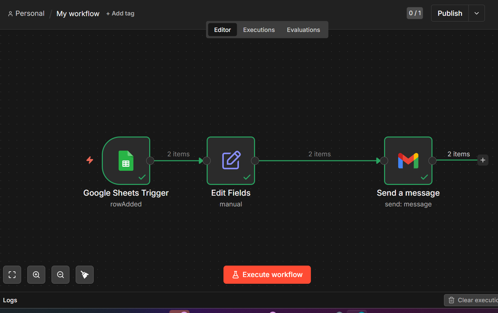
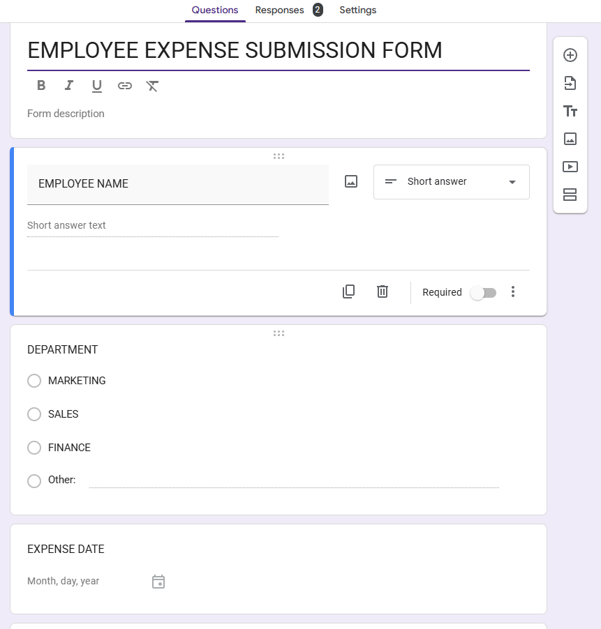
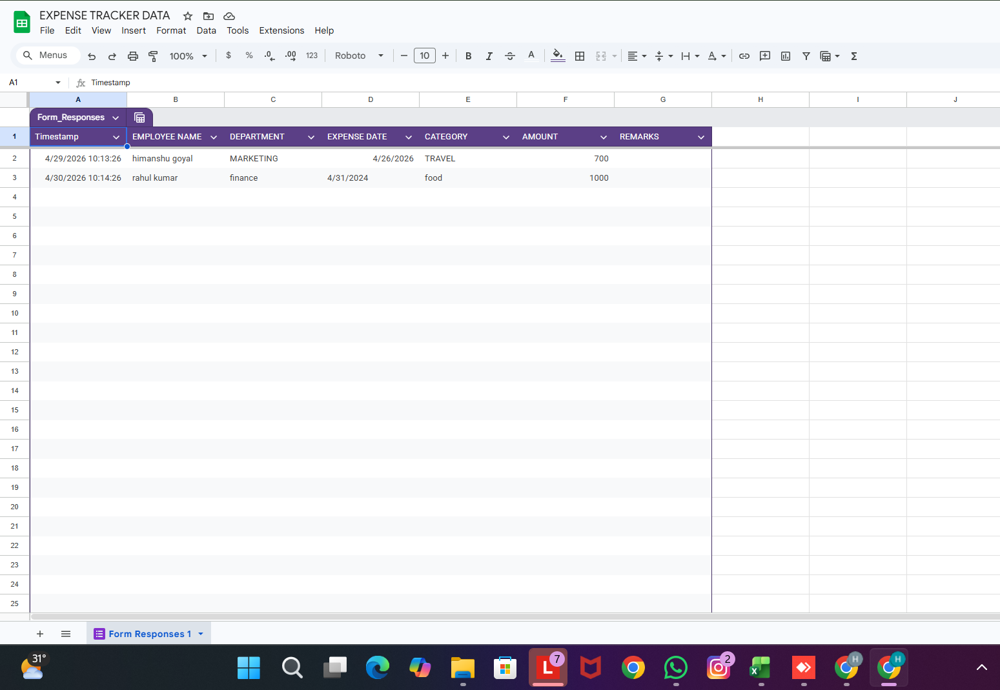
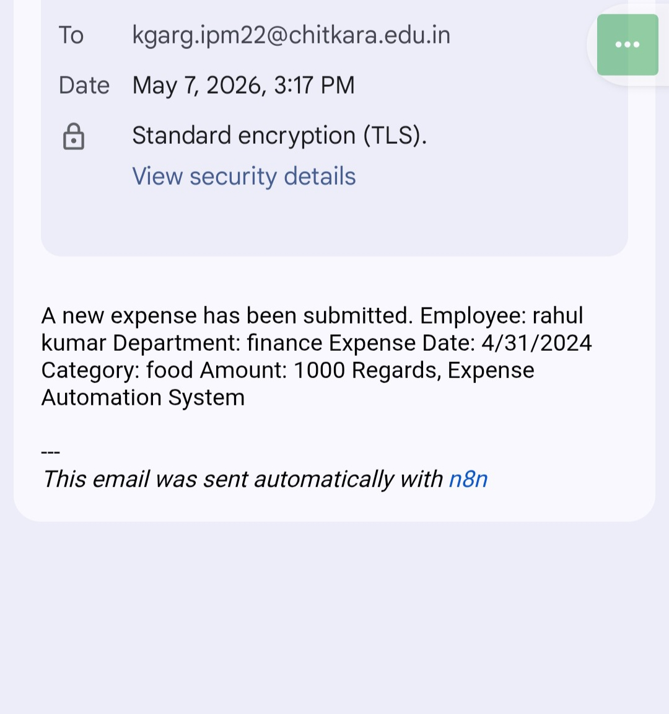

# AI Workflow Automation Presentation

This repository contains resources and presentation materials related to **AI Workflow Automation** and process integration using forms, sheets, notifications, and automated workflows.

## 📌 Project Overview

The project demonstrates how AI-powered workflow automation can improve:

- Data collection
- Process management
- Notifications
- Business efficiency
- Task automation

The repository includes workflow diagrams and screenshots showing how automated systems interact with forms, spreadsheets, and email notifications.

---

## 📂 Repository Contents

### 📧 Email Notification
**File:** `email_notification.jpeg`

Shows the automated email notification generated during the workflow process.

---

### 📝 Form View
**File:** `form_view.png`

Displays the user input form used for collecting workflow data.

---

### 📊 Sheet Data
**File:** `sheet_data.png`

Represents the spreadsheet/database where submitted data is stored and managed automatically.

---

### 🔄 Workflow Diagram
**File:** `workflow_diagram.png`

Illustrates the complete automation workflow and integration process.

---

## ⚙️ Workflow Process

The automation flow follows these steps:

1. User submits data through the form
2. Data is stored in a spreadsheet/database
3. AI or automation logic processes the data
4. Automated email notification is triggered
5. Workflow updates are managed automatically

---

## 🛠️ Technologies & Tools

- Workflow Automation
- AI Integration
- Google Forms
- Google Sheets
- Email Automation
- Process Automation Tools

---

## 🎯 Objectives

- Understand workflow automation concepts
- Demonstrate AI-based process automation
- Improve operational efficiency
- Reduce manual work
- Showcase automation integration

---

## 🚀 Applications

This project can be used for:

- Business process automation
- Student projects
- AI workflow demonstrations
- Office automation systems
- Presentation and learning purposes

---

## 📖 Learning Outcomes

After reviewing this repository, users will understand:

✔️ Workflow automation basics  
✔️ Form-to-sheet integration  
✔️ Automated notification systems  
✔️ AI-assisted process management  
✔️ Business automation concepts

---

## 📸 Screenshots

### Workflow Diagram

### Form View

### Sheet Data

### Email Notification

---

## 🤝 Contribution

Contributions and suggestions are welcome.

Feel free to fork the repository and improve the workflow system.

---

## 📄 License

This project is licensed under the MIT License.

---

## 👨‍💻 Author

**Khushi Garg**  

Interested in:
- AI Automation
- Business Management
- Workflow Systems
- Process Optimization
- Technology Integration

---
